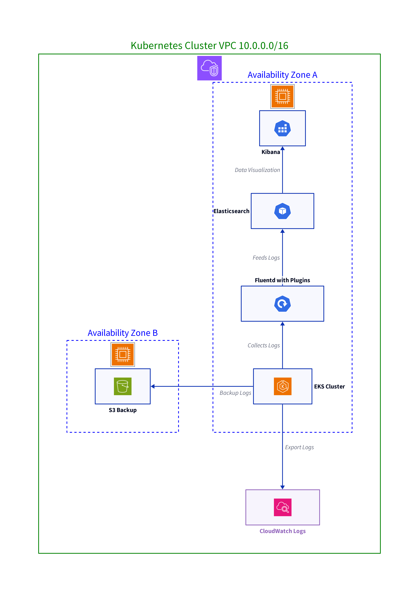

# EFK-Stack

- Installing Elastic Search, Fluentd and Kibana on Kuberentes Cluster

- The EFK stack combines Elasticsearch, Fluentd, and Kibana to efficiently manage, search, and visualize logs generated by applications running in Kubernetes clusters.

## Table of contents

- [elastic-search](./elastic-search/README.md)
- [fluentd](./fluentd/README.md)
- [kibana](./kibana/README.md)

### Components

- `Elasticsearch` acts as a highly scalable search and analytics engine.
- `Fluentd` serves as an open-source data collector for unified logging, allowing you to unify data collection and consumption for better use and understanding of data.
- `Kibana` provides the visualization layer, offering powerful and user-friendly interfaces to view and analyze the data stored in Elasticsearch.

