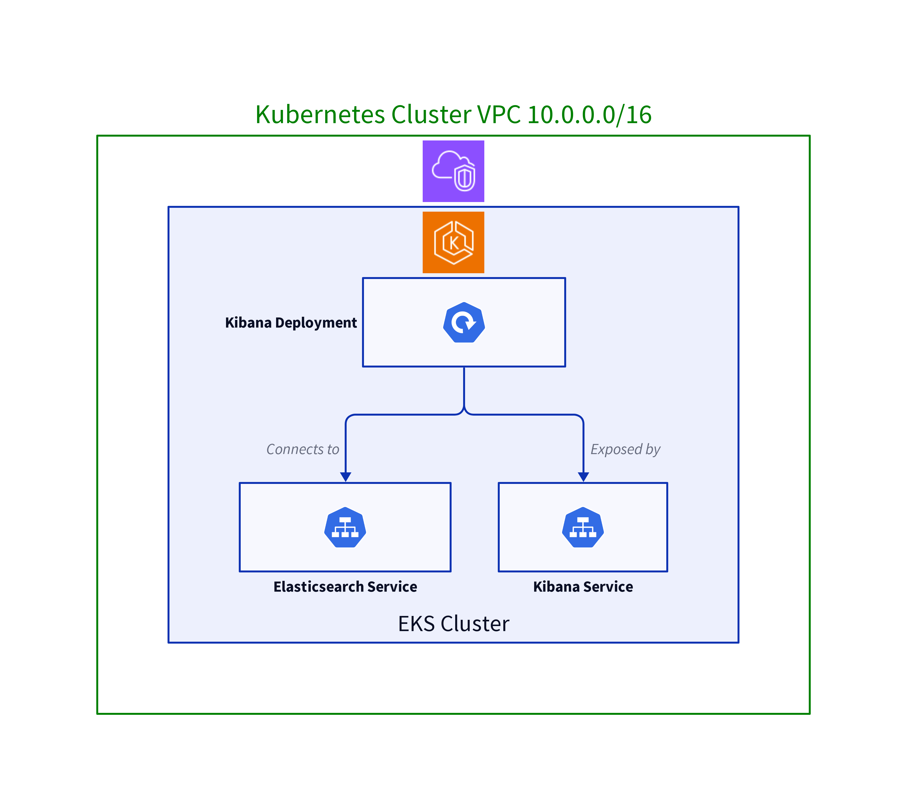

# Install Kibana on kuberentes

- Kibana is the lens that brings the details of your data into focus, allowing you to navigate through the complexities with ease. It connects to Elasticsearch, where your logs are stored, and lets you create visualizations such as charts and graphs. These visualizations are then organized into dashboards, providing you with insights at a glance.

## Kibana Deployment and Architecture Diagram

- Deploying Kibana involves creating a Deployment and a Service in Kubernetes. The Deployment ensures Kibana is running and manages replicas, while the Service makes Kibana accessible.

- Using the official Kibana image and connects to Elasticsearch via the `ELASTICSEARCH_HOSTS` environment variable. Kibana uses port 5601 by default and communicates with ELasticsearch using an HTTP REST API. To secure Kibana, the security features of Elasticsearch should be enabled.

- Diagram

### Accessing Kibana

- To explore the raw logs shipped by Fluentd, Access the Discover tab from the menu. Use the `Kibana Query Language (KQL)` to search your data. Specify an `index pattern` in order to select the data that has to be explored. By default, `Lucene` is selected.

- After having explored the logs, We can create dashboards to aggregate your data from various search operations. Also import or export dashboards. Kibana dashboards are exported in the `.ndjson` format.

- Access The interface using the IP address of any node in the cluster and the node port specified in the Service configuration `http://<node-ip>:node-port` .

